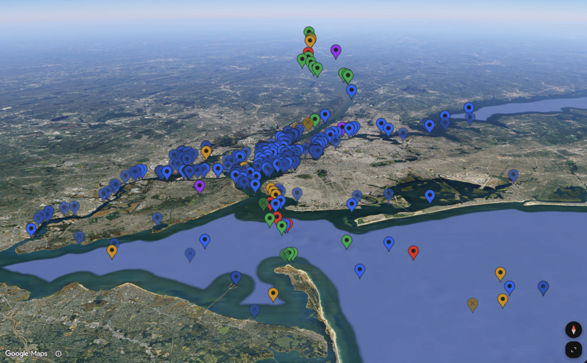

# ais-cache
AIS cache for NMEA over TCP and JSON over WebSocket consumers.

[](http://ais.jessetane.com)

## Why
AIS static data messages containing vessel name, type, dimensions, etc. are only broadcast every 3 to 6 minutes. When connecting a chartplotter (e.g. OpenCPN, Navionics) to a "dumb" NMEA stream, it can take a long time to resolve these critical target details, which is especially noticable on powerup or after a reboot. This progam decodes and caches vessel state along with raw NMEA messages of each AIS type so clients can be instantly hydrated at connection time.

## How

### Service
Live deployment in Red Hook covering NYC harbor available for public use (absolutely zero availability guarantees, do NOT use this service for navigational safety):

- **Map**: [https://ais.jessetane.com](https://ais.jessetane.com)
- **TCP**: `ais.jessetane.com:9001` (try connecting your chart plotter)
- **WebSocket**: `wss://ais.jessetane.com:9002` (build your own apps)

### Server
Start `web.js` with a serial port, upstream TCP server, or both for input:

```bash
# Direct serial port input (standalone)
SERIAL_PORT=/dev/ttyAMA0 ./web.js

# Upstream TCP source (e.g. from tcp.js or remote feed)
./web.js

# Both direct serial and upstream TCP source
SERIAL_PORT=/dev/ttyAMA0 AIS_HOST=example.com AIS_PORT=9000 ./web.js
```

### TCP Stream
Connect any NMEA over TCP consumer to port `9001`:

```bash
nc localhost 9001
```

### WebSocket Feed
Connect to the WebSocket server (`ws://localhost:9002`):

```js
const ws = new WebSocket('ws://localhost:9002')

// first message receives the full snapshot of active vessels
// subsequent messages deliver arrays of updated vessels
ws.onmessage = ({ data }) => {
	const vessels = JSON.parse(data)
	console.log('vessels:', vessels)
}
```

## Configuration
Can be done via environment variables:

### `web.js`
- `SERIAL_PORT` (e.g. `/dev/ttyAMA0`, optional)
- `SERIAL_BAUD_RATE` (`115200`)
- `SERIAL_PORT_RECONNECT` (`5000`, falls back to `AIS_RECONNECT`)
- `AIS_HOST` (`::1` if `SERIAL_PORT` is unset, otherwise `null`)
- `AIS_PORT` (`9000`)
- `AIS_RECONNECT` (`5000`)
- `TCP_HOST` (`::`)
- `TCP_PORT` (`9001`)
- `WS_HOST` (`::`)
- `WS_PORT` (`9002`)
- `STATE_FILE` (`./state.json`)
- `STATE_SAVE_RATE` (`30000`)

### `tcp.js`
- `SERIAL_PORT` (`/dev/ttyAMA0`)
- `SERIAL_BAUD_RATE` (`115200`)
- `SERIAL_PORT_RECONNECT` (`5000`)
- `TCP_HOST` (`::`)
- `TCP_PORT` (`9000`)

## Hardware
Developed and tested on a [Raspberry Pi 5](https://www.raspberrypi.com/products/raspberry-pi-5/) with a [dAISy Catcher AIS Receiver HAT](https://shop.wegmatt.com/products/daisy-catcher-high-performance-ais-receiver). 

## License
MIT
